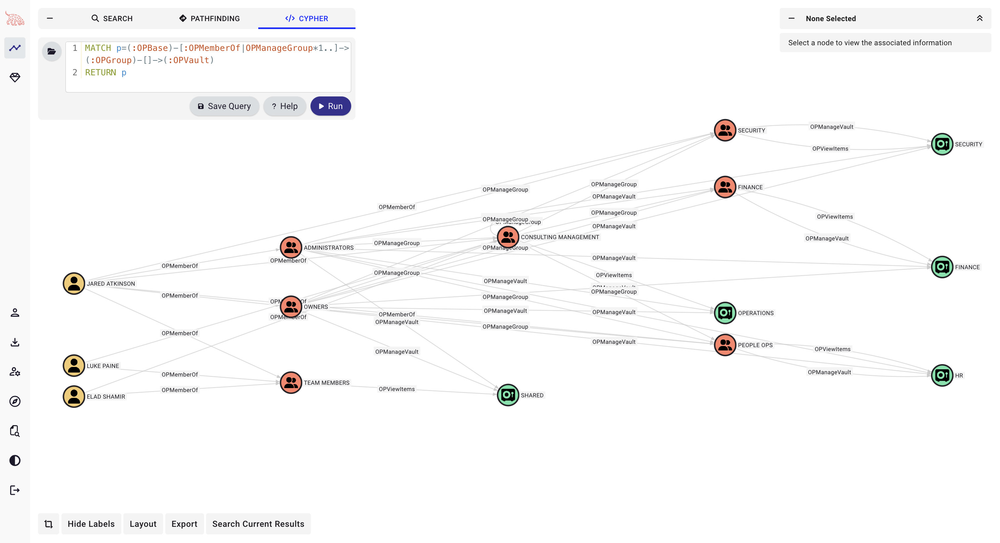
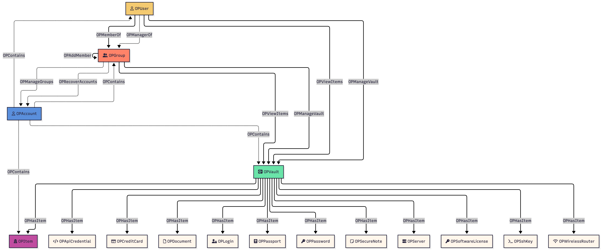

# 1PassHound



## Overview

The **1Password for Business OpenGraph** extension lets you bring your 1Password ACL data into BloodHound’s graph‑analysis framework. With this extension, you can:

- **Model Your 1Password Estate**  
  Represent your business account as a graph of nodes—accounts, users, groups, vaults and every kind of item (logins, secure notes, cards, etc.)—each decorated with its own Font Awesome icon and color.

- **Map Every Permission & Membership**  
  Capture all relationships with edges like `OPContains`, `OPMemberOf`, `OPViewItems`, `OPManageVault`, `OPHasItem`, `OPManageGroups` and `OPRecoverAccounts`.

- **Collect via the 1Password CLI**  
  Use the PowerShell script (`Invoke-1PassHound`) to wrap the `op` CLI, fetch Users, Groups, Vaults and Items from your local 1Password session, and emit a BloodHound‑compatible JSON file (`1pass_<accountid>.json`).

- **Visualize & Analyze in BloodHound**  
  Once imported, you’ll be able to:
  - **Audit & Compliance**: Verify who really has access to which vaults or items.  
  - **Incident Response**: Trace potential exposure paths and remediate unintended permissions.  
  - **Security Reviews**: Explore group memberships, vault structures and item distribution at a glance.

Whether you’re auditing permissions, responding to incidents, or simply exploring your 1Password configuration, this extension brings clarity, control and rich visualization to your vaults and items.  

## Collector Setup & Usage

1. **PowerShell Prerequisite**  
   - Requires **PowerShell 3.0+** on any platform where both PowerShell and the `op` CLI run.

2. **Install the 1Password CLI**  
   - Follow the official guide to install `op` and ensure it’s in your `PATH`:  
     https://developer.1password.com/docs/cli/get-started/#step-1-install-1password-cli

3. **Enable Desktop‑App Integration**  
   - Turn on the 1Password desktop‑app integration so the CLI can authenticate via your signed‑in app:  
     https://developer.1password.com/docs/cli/get-started/#step-2-turn-on-the-1password-desktop-app-integration

     NOTE: You will only be able to collect information about Groups and Vaults that you have access to. There may be ways to reduce the necessary permissions, but for now we've only verified full visibility via an account in the Administrators group.

4. **Authenticate**  
   - From your macOS or Windows PowerShell session, run:  

     ```powershell
     op signin <your-subdomain>
     ```

   - This exports an `OP_SESSION_<account>` environment variable that the collector uses.

5. **Load & Run the Collector**  
   - In the repo root (where `1passhound.ps1` lives), dot‑source the script so its functions become available:

     ```powershell
     . .\1passhound.ps1
     ```

   - Then execute the main function:

     ```powershell
     Invoke-1PassHound
     ```

   - By default, this will emit a BloodHound‑compatible JSON graph named:  

     ```bash
     1pass_<accountid>.json
     ```

6. **Dependencies**  
   - No extra PowerShell modules are required—just built‑in cmdlets plus the `op` CLI.

7. **Platform Support**  
   - Verified on **macOS** (PowerShell Core) and expected to work on **Windows PowerShell 3.0+** (and PowerShell Core on Linux).

#### Required Permissions

## Schema



Below is the complete set of nodes and edges as defined in the [model](./model.json).

### Nodes

Nodes correspond to each object type (accounts, vaults, users, groups, and all item sub‑types).

| Node                                                                           | Description                                                                                  | Icon        | Color   |
|--------------------------------------------------------------------------------|----------------------------------------------------------------------------------------------|-------------|---------|
|  OPAccount                 | Top‑level account resource                                                                   | building    | #5A8FDC |
|  OPUser                       | A user belonging to an account                                                               | user        | #F4CA70 |
|  OPGroup                     | A group of users within an account                                                           | user-group  | #FF8369 |
|  OPVault                     | A vault/container that holds items                                                           | vault       | #6AE4A9 |
|  OPItem                       | Abstract item resource (parent of specific item types)                                       | passport    | #C04EA0 |
|  OPApiCredential     | An API key, token, or secret used by applications or services to authenticate against an API | code        | #FFF6EB |
|  OPCreditCard           | A stored payment card record, including card number, expiration date, and billing details    | credit-card | #FFF6EB |
|  OPDocument               | An arbitrary file or document (PDF, Word, spreadsheet, etc.) attached to a vault             | file        | #FFF6EB |
|  OPLogin                     | A website or service login record containing a username and password pair                    | user-lock   | #FFF6EB |
|  OPPassport               | A secure note formatted for passport information (number, issue/expiry dates, etc.)          | passport    | #FFF6EB |
|  OPPassword               | A standalone password entry, not tied to a specific login record.                            | key         | #FFF6EB |
|  OPSecureNote           | A free‑form secure note for storing text, URLs, or other free‑form data                      | note-sticky | #FFF6EB |
|  OPServer                   | Credentials for server access (SSH password, IP address, etc.)                               | server      | #FFF6EB |
|  OPSoftwareLicense | A software license key or file, optionally with purchase/expiry metadata                     | key         | #FFF6EB |
|  OPSshKey                   | An SSH key pair (public + private) for authenticating to servers                             | terminal    | #FFF6EB |
|  OPWirelessRouter   | Wi‑Fi network credentials (SSID, passphrase, encryption type)                                | wifi        | #FFF6EB |

### Edges

Edges capture every relationship; who contains what, membership, view vs. manage permissions, etc.

| Edge Type          | Source           | Target            | Description                                  | Travesable |
|--------------------|------------------|-------------------|----------------------------------------------| ---------- |
| `OPContains`       | `OPAccount`      | `OPItem`          | Account contains items                       | n          |
| `OPContains`       | `OPAccount`      | `OPUser`          | Account contains users                       | n          |
| `OPContains`       | `OPAccount`      | `OPVault`         | Account contains vaults                      | n          |
| `OPContains`       | `OPAccount`      | `OPGroup`         | Account contains groups                      | n          |
| `OPHasItem`        | `OPVault`        | `OPItem`          | Vault holds items                            | y          |
| `OPViewItems`      | `OPUser`         | `OPVault`         | User can view items in the vault             | y          |
| `OPViewItems`      | `OPGroup`        | `OPVault`         | Group can view items in the vault            | y          |
| `OPManageVault`    | `OPUser`         | `OPVault`         | User can manage the vault                    | y          |
| `OPManageVault`    | `OPGroup`        | `OPVault`         | Group can manage the vault                   | y          |
| `OPMemberOf`       | `OPUser`         | `OPGroup`         | User is a member of a group                  | y          |
| `OPManageGroups`   | `OPGroup`        | `OPAccount`       | Group can manage other groups in the account | y          |
| `OPRecoverAccounts`| `OPGroup`        | `OPAccount`       | Group can recover accounts                   | y          |

## Contributing

We welcome and appreciate your contributions! To make the process smooth and efficient, please follow these steps:

1. **Discuss Your Idea**  
   - If you’ve found a bug or want to propose a new feature, please start by opening an issue in this repo. Describe the problem or enhancement clearly so we can discuss the best approach.

2. **Fork & Create a Branch**  
   - Fork this repository to your own account.  
   - Create a topic branch for your work:

     ```bash
     git checkout -b feat/my-new-feature
     ```

3. **Implement & Test**  
   - Follow the existing style and patterns in the repo.  
   - Add or update any tests/examples to cover your changes.  
   - Verify your code runs as expected:

     ```bash
     # e.g. dot-source the collector and run it, or load the model.json in BloodHound
     ```

4. **Submit a Pull Request**  
   - Push your branch to your fork:

     ```bash
     git push origin feat/my-new-feature
     ```
 
   - Open a Pull Request against the `main` branch of this repository.  
   - In your PR description, please include:
     - **What** you’ve changed and **why**.  
     - **How** to reproduce/test your changes.

5. **Review & Merge**  
   - I’ll review your PR, give feedback if needed, and merge once everything checks out.  
   - For larger or more complex changes, review may take a little longer—thanks in advance for your patience!

Thank you for helping improve this extension! 🎉  

## Licensing

```
Copyright 2025 Jared Atkinson

Licensed under the Apache License, Version 2.0
you may not use this file except in compliance with the License.
You may obtain a copy of the License at

    http://www.apache.org/licenses/LICENSE-2.0

Unless required by applicable law or agreed to in writing, software
distributed under the License is distributed on an "AS IS" BASIS,
WITHOUT WARRANTIES OR CONDITIONS OF ANY KIND, either express or implied.
See the License for the specific language governing permissions and
limitations under the License.
```

Unless otherwise annotated by a lower-level LICENSE file or license header, all files in this repository are released
under the `Apache-2.0` license. A full copy of the license may be found in the top-level [LICENSE](LICENSE) file.

##### Default Group Permissions

| Permission Name             | Owners | Administrators | Recovery | Provision Managers |
| --------------------------- | ------ | -------------- | -------- | ------------------ |
| ADD_PERSON                  | x      | x              |          |                    |
| CHANGE_PERSON_NAME          | x      | x              |          |                    |
| CHANGE_TEAM_ATTRIBUTES      | x      | x              |          |                    |
| CHANGE_TEAM_DOMAIN          | x      | x              |          |                    |
| CHANGE_TEAM_SETTINGS        | x      | x              |          |                    |
| CREATE_VAULTS               | x      | x              |          |                    |
| DELETE_PERSON               | x      | x              |          |                    |
| DELETE_TEAM                 | x      |                |          |                    |
| MANAGE_BILLING              | x      |                |          |                    |
| MANAGE_GROUPS               | x      | x              |          |                    |
| MANAGE_TEMPLATES            | x      | x              |          |                    |
| MANAGE_VAULTS               | x      |                |          |                    |
| PROVISION_PEOPLE            |        |                |          | x                  |
| SUSPEND_PERSON              | x      | x              |          |                    |
| SUSPEND_TEAM                | x      |                |          |                    |
| RECOVER_ACCOUNTS            | x      | x              | x        |                    |
| VIEW_ACTIVITY_LOGS          | x      | x              |          |                    |
| VIEW_ADMINISTRATIVE_SIDEBAR | x      | x              | x        |                    |
| VIEW_BILLING                | x      |                |          |                    |
| VIEW_PEOPLE                 | x      | x              | x        |                    |
| VIEW_TEAM_SETTINGS          | x      | x              |          |                    |
| VIEW_TEMPLATES              | x      | x              |          |                    |
| VIEW_VAULTS                 | x      | x              |          |                    |

##### Group Permission Categories

| Permission Name             | View Administrative Sidebar | Manage Settings | Manage Billings | Delete Account | Suspend People | Invite & Remove People | Manage People | Create Vaults | Recover Accounts | Manage All Groups |
| --------------------------- | --------------------------- | --------------- | --------------- | -------------- | -------------- | ---------------------- | ------------- | ------------- | ---------------- | ----------------- |
| ADD_PERSON                  |                             |                 |                 |                |                | *6*                    |               |               |                  |                   |
| CHANGE_PERSON_NAME          |                             |                 |                 |                |                |                        | *7*           |               |                  |                   |
| CHANGE_TEAM_ATTRIBUTES      |                             | *2*             |                 | 2              |                |                        |               |               |                  |                   |
| CHANGE_TEAM_DOMAIN          |                             | *2*             |                 | 2              |                |                        |               |               |                  |                   |
| CHANGE_TEAM_SETTINGS        |                             | *2*             |                 | 2              |                |                        |               |               |                  |                   |
| CREATE_VAULTS               |                             |                 |                 |                |                |                        |               | *8*           |                  |                   |
| DELETE_PERSON               |                             |                 |                 |                |                | *6*                    |               |               |                  |                   |
| DELETE_TEAM                 |                             |                 |                 | *4*            |                |                        |               |               |                  |                   |
| MANAGE_BILLING              |                             |                 | *3*             | 3              |                |                        |               |               |                  |                   |
| MANAGE_GROUPS               |                             |                 |                 |                |                |                        |               |               |                  | *10*              |
| MANAGE_TEMPLATES            |                             | *2*             |                 | 2              |                |                        |               |               |                  |                   |
| MANAGE_VAULTS               |                             |                 |                 |                |                |                        |               |               |                  |                   |
| PROVISION_PEOPLE            |                             |                 |                 |                |                |                        |               |               |                  |                   |
| SUSPEND_PERSON              |                             |                 |                 |                | *5*            | 5                      |               |               |                  |                   |
| SUSPEND_TEAM                |                             |                 |                 | *4*            |                |                        |               |               |                  |                   |
| RECOVER_ACCOUNTS            |                             |                 |                 |                |                |                        |               |               |                  |                   |
| VIEW_ACTIVITY_LOGS          | *1*                         | 1               |                 |                |                |                        |               |               | *9*              |                   |
| VIEW_ADMINISTRATIVE_SIDEBAR | *1*                         | 1               |                 | 1              | 1              | 1                      | 1             |               | 1                | 1                 |
| VIEW_BILLING                |                             |                 | *3*             | 3              |                |                        |               |               |                  |                   |
| VIEW_PEOPLE                 | *1*                         | 1               |                 | 1              | 1              | 1                      | 1             |               | 1                | 1                 |
| VIEW_TEAM_SETTINGS          | *1*                         | 1               |                 | 1              | 1              | 1                      | 1             |               | 1                | 1                 |
| VIEW_TEMPLATES              | *1*                         | 1               |                 | 1              | 1              | 1                      | 1             |               | 1                | 1                 |
| VIEW_VAULTS                 | *1*                         | 1               |                 | 1              | 1              | 1                      | 1             |               | 1                | 1                 |
